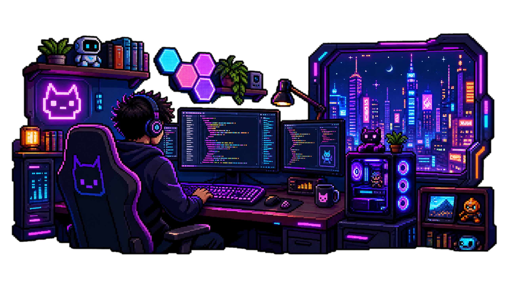
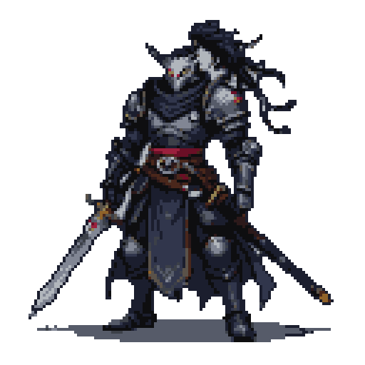
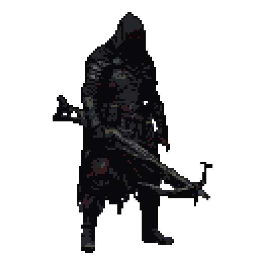

🚀 Olá! Sou Gean Santos, um desenvolvedor em formação que busca constantemente a excelência, a inovação e o aperfeiçoamento das minhas habilidades técnicas. Minha trajetória é guiada pela curiosidade e pela vontade de criar soluções que façam a diferença, seja no desenvolvimento web, na criação de jogos ou na arquitetura de sistemas. 

**🚀 Projetos e Aprendizado**

• 🎯 Atualmente, estou engajado no desenvolvimento de um Software as a Service (SaaS), aprofundando meus estudos em desenvolvimento de jogos e criando websites e  portfólios, sempre com o objetivo de evoluir e entregar soluções modernas e de alta qualidade.  

• 💻 Minhas áreas de estudo atuais incluem C++, Python e CSS.  

• 🤝 Busco ativamente oportunidades para colaborar em projetos inovadores, contribuindo com soluções criativas e enfrentando novos desafios técnicos.  

• 🎨 Procuro assistência para o desenvolvimento de animações e experiências visuais imersivas.  

• 📬 Estou disponível para discussões sobre HTML, CSS, JavaScript, PHP, SQL e o desenvolvimento web em geral.  

• 📧 Para contato, utilize o e-mail: geanoliveirasantos244@gmail.com  

• 🏆 Curiosidade: Fui classificado entre os 1.000 melhores jogadores brasileiros de Clash Royale.

**🔗 Conecte-se comigo:**

  

**🛠️ Tecnologias e Ferramentas**

  
  
  
  
  
  
  

  
  

